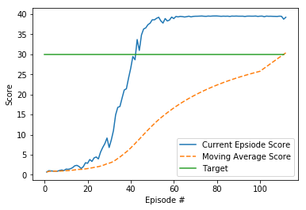

## Implementation

### Algo used: Deep Deterministic Policy Gradient (DDPG)

This project implements **Deep Deterministic Policy Gradient** and described in the paper [Continuous control with deep reinforcement learning](https://arxiv.org/abs/1509.02971). 

DDPG uses four neural networks: a Q network, a deterministic policy network, a target Q network, and a target policy network. The Q network and policy network is very much like simple Advantage Actor-Critic, but in DDPG, the Actor directly maps states to actions (the output of the network directly the output) instead of outputting the probability distribution across a discrete action space. The target networks are time-delayed copies of their original networks that slowly track the learned networks. Using these target value networks greatly improve stability in learning. Here’s why: In methods that do not use target networks, the update equations of the network are interdependent on the values calculated by the network itself, which makes it prone to divergence. For example:


The algo can be summarized with the pseudocode below


The algo can be broken down into four parts
- Experience replay
    - As used in Deep Q learning (and many other RL algorithms), DDPG also uses a replay buffer to sample experience to update neural network parameters. During each trajectory roll-out, we save all the experience tuples (state, action, reward, next_state) and store them in a finite-sized cache — a “replay buffer.” Then, we sample random mini-batches of experience from the replay buffer when we update the value and policy networks. 
- Actor & Critic network updates
    - The value network is updated similarly as is done in Q-learning. However, in DDPG, the next-state Q values are calculated with the target value network and target policy network. Then, we minimize the mean-squared loss between the updated Q value and the original Q value.
- Target network updates
    -  We make a copy of the target network parameters and have them slowly track those of the learned networks via “soft updates,” as illustrated below
    
- Exploration
    - In Reinforcement learning for discrete action spaces, exploration is done via probabilistically selecting a random action (such as epsilon-greedy or Boltzmann exploration). For continuous action spaces, exploration is done via adding noise to the action itself (there is also the parameter space noise but we will skip that for now). In the DDPG paper, the authors use Ornstein-Uhlenbeck Process to add noise to the action output (Uhlenbeck & Ornstein, 1930). The Ornstein-Uhlenbeck Process generates noise that is correlated with the previous noise, as to prevent the noise from canceling out or “freezing” the overall dynamics.

### Code Structure

The implementation mainly lies in the following three files
- `Continuous_Control.ipynb` : The notebook instantiate the agent defined in ther other two scripts and contains the scores result

- `model.py` : Implementation of the **Actor** and the **Critic** classes.
    - The Actor and Critic classes each implements a *Target* and a *Local* Neural Networks used for the training.
    
- `ddpg_agent.py` : Implement the **DDPG agent** and a **Replay Buffer memory** used by the DDPG agent.
    - Compared to the lesson sample code, added support for multi-agent, specifically in `(self, states, actions, rewards, next_states, dones)`, also added support for multiple updates every 20 timesteps 
    - The Actor's *Local* and *Target* neural networks, and the Critic's *Local* and *Target* neural networks are instanciated by the Agent's constructor
    - The `learn()` method updates the policy and value parameters using given batch of experience tuples.
        ```
        Q_targets = r + γ * critic_target(next_state, actor_target(next_state))
        where:
            actor_target(state) -> action
            critic_target(state, action) -> Q-value
        ```

### Parameter Search and the Result

- Batch normalization improved the agent's performance a bit although it was not used the original paper.
- I added one additional hidden layer to the **Actor** provided in lessons. I didn't include more layers as the problem space is not that complex.
- Learn 10 times every 20 timesteps, as suggested by the instruction.
- Added decay to the OU noise so we can achieve better performance when we are more confident about our policy. 
- Set learning rate to 1e-3 to allow the agent learn fast enough

#### DDPG parameters

The final version of my DDPG agent uses the following parameters values (These parameters are passed in the main training function `ddpg(...)` defined and called in the notebook.)

```
BUFFER_SIZE = int(1e6)  # replay buffer size
BATCH_SIZE = 128        # minibatch size
GAMMA = 0.99            # discount factor
TAU = 1e-3              # for soft update of target parameters
LR_ACTOR = 1e-3         # learning rate of the actor 
LR_CRITIC = 1e-3        # learning rate of the critic
WEIGHT_DECAY = 0        # L2 weight decayf the critic
LEARN_EVERY = 20        # learning timestep interval
LEARN_NUM = 10          # number of learning passes
GRAD_CLIPPING = 1.0     # gradient clipping
EPSILON = 1.0           # initial epsilon of the random noise
EPSILON_DECAY = 1e-6    # decay of the random noise
```

**Actor** NN has the following structure :

```
Input nodes (33) -> Fully Connected Layer (400 nodes, Relu activation) -> Batch Normlization -> Fully Connected Layer (300 nodes, Relu activation) -> Ouput nodes (4 nodes, tanh activation)
```


**Critic** NN has the following structure :

```
Input nodes (33) -> Fully Connected Layer (400 nodes, Relu activation) -> Batch Normlization-> Include Actions at the second fully connected layer -> Fully Connected Layer (300+4 nodes, Relu activation) -> Ouput node (1 node, no activation)
```
            
#### The Result

The trained agent is able to solve the problem in around 500 episodes.



## Future Plans
- Play with PPO, A3C, and D4PG to see if they produce more pleasing results.
- Better encapsule the code so that we can change the learning frequency and neural network structure more easily.
- Improve DDPG with prioritized experience replay
